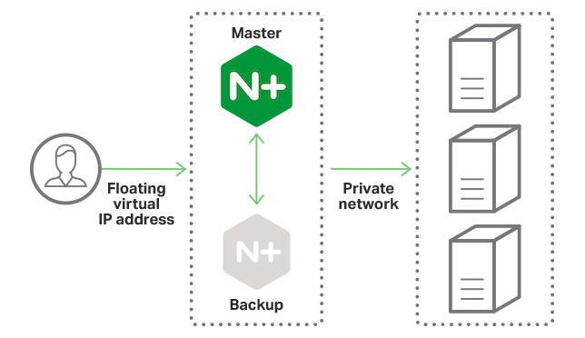

# nginx-high-availability
How to Set up Nginx High Availability with Pacemaker and Corosync on CentOS 7

[document](https://www.howtoforge.com/tutorial/how-to-set-up-nginx-high-availability-with-pacemaker-corosync-on-centos-7/)



```
Step 1 - Map the Host File
Step 2 - Install Epel Repository and Nginx
Step 3 - Install and configure Pacemaker, Corosync, and Pcsd
Step 4 - Create and Configure the Cluster
Step 5 - Disable STONITH and Ignore the Quorum Policy
Step 6 - Add the Floating-IP and Resources
Step 7 - Add Constraint Rules to the Cluster
Step 8 - Configure Firewalld
Step 9 - Testing
Reference
```
### Diagram
```

------------+---------------------------+---------------------------+------------
            |                           |                           |
        eth0|10.0.15.10          eth0|10.0.15.11         eth0|10.0.15.12
+-----------+-----------+   +-----------+-----------+   +-----------+-----------+
|    [ web01 ]          |   |    [ web02 ]          |   |    [ web03 ]          |
|                       |   |                       |   |                       |
|  nginx                |   |     nginx             |   |     nginx             |
|  corosync             |   |     corosync          |   |     corosync          |
|  pacemaker            |   |     pacemaker         |   |     pacemaker         |
|  pcs                  |   |     pcs               |   |     pcs               |
|                       |   |                       |   |                       |
|                       |   |                       |   |                       |
+-----------------------+   +-----------+-----------+   +-----------------------+
```

```
Prerequisites

2 or more CentOS 7 Server
web01       10.0.15.10
web02       10.0.15.11
web03       10.0.15.12
Floating IP Address 10.0.15.15
Root Privileges
```


### Step 1 - Map the Host File

Note: Run step 1 - 3 on all servers web01, web02 and web03.

The first step we must do is to edit the host file on each server in order to map the hostname of all servers. We've 'web01', 'web02' and 'web03' servers, login to the each server with the ssh account

- Edit the '/etc/hosts' file with vim.
    ```
    # vim /etc/hosts
    ```
    ```
    10.0.15.10      web01
    10.0.15.11      web02
    10.0.15.12      web03
    ```
    Save and exit.

### Step 2 - Install Epel Repository and Nginx
In this step, we will install the epel repository and then install the Nginx web server. EPEL or Extra Packages for Enterprise Linux repository is needed for installing Nginx packages.
Install EPEL Repository using the following yum command.
- on all node
    ```
    # yum -y install epel-release
    ```

- Now install Nginx web server from the EPEL repository.
    ```
    # yum -y install nginx
    ```
- After the installation is complete, change the default index.html page on each server with a new page.

    ```
    ##Run Command on 'web01'
    echo '<h1>web01 - hakase-labs</h1>' > /usr/share/nginx/html/index.html

    ##Run Command on 'web02'
    echo '<h1>web02 - hakase-labs</h1>' > /usr/share/nginx/html/index.html

    ##Run Command on 'web03'
    echo '<h1>web03 - hakase-labs</h1>' > /usr/share/nginx/html/index.html
    ```


### Step 3 - Install and configure Pacemaker, Corosync, and Pcsd
- document pcs: [configuring_the_red_hat_high_availability_add-on_with_pacemaker](https://access.redhat.com/documentation/en-us/red_hat_enterprise_linux/6/html/configuring_the_red_hat_high_availability_add-on_with_pacemaker) 
- Pacemaker, Corosync, and Pcsd are available in the default system repository. So they all can be installed from the CentOS repository using the following yum command.

    ````
    # yum -y install corosync pacemaker pcs
    ```

- After the installation has been completed, enable all services to launch automatically at system boot using the systemctl commands below.

    ```
    # systemctl enable pcsd
    # systemctl enable corosync
    # systemctl enable pacemaker
    ```

- Now start the pcsd Pacemaker command line interface on all servers.

    ```
    # systemctl start pcsd
    ```

- Next, create a new password for 'hacluster' user and use the same password for all servers. This user has been created automatically during software installation.

- Here's how you configure a password for the 'hacluster' user.

    ```
    # passwd hacluster
    Enter new password:
    ```

- High Availability software stack Pacemaker, Corosync, and Pcsd are installed on to the system.

### Step 4 - Create and Configure the Cluster

- Note: Run steps 4 - 7 on 'web01' only.

- In this step, we will create a new cluster with 3 centos servers. Then configure the Floating IP address and add new Nginx resources.

- To create the cluster, we need to authorize all servers using the pcs command and the hacluster user.

- Authorize all servers with the pcs command and hacluster user and password.

    ```
    # pcs cluster auth web01 web02 web03
    Username: hacluster
    Password: aqwe123@
    ```
- Now it's time set up the cluster. Define the cluster name and all servers that will be part of the cluster.

    ```
    # pcs cluster setup --name hakase_cluster web01 web02 web03

    ```

- Now start all cluster services and also enable them.

    ```
    # pcs cluster start --all
    # pcs cluster enable --all
    ```

- Next, check the cluster status.

    ```
    # pcs status cluster
    ```

### Step 5 - Disable STONITH and Ignore the Quorum Policy

- Since we're not using the fencing device, we will disable the STONITH. STONITH or Shoot The Other Node In The Head is the fencing implementation on Pacemaker. If you're in production, it's better to enable STONITH.

- Disable STONITH with the following pcs command.

    ```
    # pcs property set stonith-enabled=false
    ```

- Next, for the Quorum policy, ignore it.

    ```
    # pcs property set no-quorum-policy=ignore
    ```

- Check the property list and make sure stonith and the quorum policy are disabled.

    ```
    # pcs property list

    ```

- The STONITH and Quorum Policy is disabled.

### Step 6 - Add the Floating-IP and Resources
- Floating IP is the IP address that can be migrated/moved automatically from one server to another server in the same Data Center. And we've already defined the floating IP address for the Pacemaker High-Availability to be '10.0.15.15'. Now we want to add two resources, the Floating IP address resource with the name 'virtual_ip' and a new resource for the 
- Nginx web server named 'webserver'.

- Add the new resource floating IP address 'virtual_ip' using the pcs command as shown below.

    ```
    # pcs resource create virtual_ip ocf:heartbeat:IPaddr2 ip=10.0.15.15 cidr_netmask=32 op monitor interval=30s
    ```


- Next, add a new resource for the Nginx 'webserver'.

    ```
    # pcs resource create webserver ocf:heartbeat:nginx configfile=/etc/nginx/nginx.conf op monitor timeout="5s" interval="5s"
    ```


- Make sure you got no error result, then check the resources available.

    ```
    # pcs status resources
    ```
- You will see two resources 'virtual_ip' and a 'webserver'. New resources for the Floating IP and Nginx web server have been added.

### Step 7 - Add Constraint Rules to the Cluster

- In this step, we will setup High Availability Rules, and will setup resource constraint with the pcs command line interface.

- Set the collation constraint for webserver and virtual_ip resources with score 'INFINITY'. Also, setup the webserver and virtual_ip resources as same on all server nodes.

    ```
    # pcs constraint colocation add webserver virtual_ip INFINITY
    ```

- Set the 'virtual_ip' and 'webserver' resources always on same node servers.

    ```
    # pcs constraint order virtual_ip then webserver
    ```

- Next, stop the cluster and then start again.

    ```
    # pcs cluster stop --all
    # pcs cluster start --all
    ```

- Now, check again the resources and you will see their status as 'Started' on the same server 'web01'.

    ```
    # pcs status resources
    ```
- virtual_ip and webserver resources have been started on the same server/node 'web01'.


### Step 8 - Configure Firewalld
- The HA-Cluster will run under the firewall configuration firewalld - install it if you do not have the package.
    ```
    # yum -y install firewalld
    ```
- Start firewalld and enable it to run automatically every time at system boot using following systemctl commands.
    ```
    # systemctl start firewalld
    # systemctl enable firewalld
    ```
- Next, add new services to the firewalld with firewall-cmd commands - add high-availability service, HTTP, and HTTPS services for Nginx.

    ```
    # firewall-cmd --permanent --add-service=high-availability
    # firewall-cmd --permanent --add-service=http
    # firewall-cmd --permanent --add-service=https
    ```


- Reload the firewall configuration, and check all services.
    ```
    # firewall-cmd --reload
    # firewall-cmd --list-all
    ````

- Make sure ha service with HTTP and https is there on the list.


### Step 9 - Testing
- In this step, we're gonna do some test for the cluster. Test the node status ('Online' or 'Offline'), test the corosync members and status, and then test the high-availability of the Nginx webserver by accessing the Floating IP address.

- Test node status with the following command.

    ```
    # pcs status nodes
    ```

- All nodes are up 'Online'.

- Test the corosync members.
    ```
    # corosync-cmapctl | grep members
    ```

- You will get Corosync members IP address.

- Check the Corosync members, and you will see the result as shown below.

    ```
    # pcs status corosync
    ```

- And lastly, check the webserver High Availability. Open your web browser and type the Floating IP address '10.0.15.15'.

- You will see the web page from the 'web01' server.


- Next, stop the cluster on the 'web01' server with the command below.
    ```
    # pcs cluster stop web01
    ```
- And check again the page, and you will get the page from the 'web02' server as below.


#### Additional:

- Check the cluster status with the command below.
    ```
    # pcs status
    ```

- And you will get the result as shown below.

Setup of Nginx webserver High Availability with Pacemaker, Corosync, and Pcsd on CentOS 7 server has been completed successfully.

#### thanks you!
